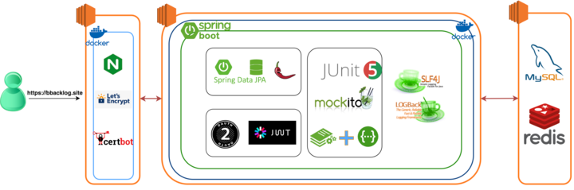
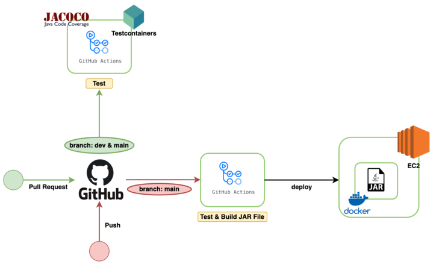
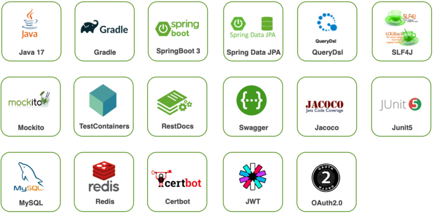
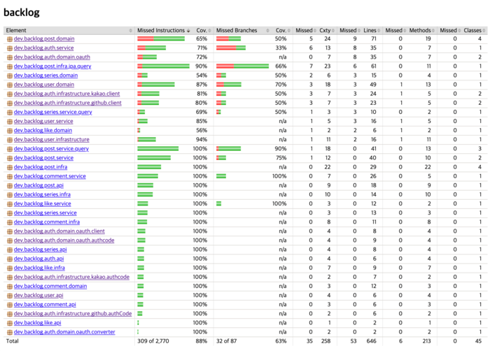
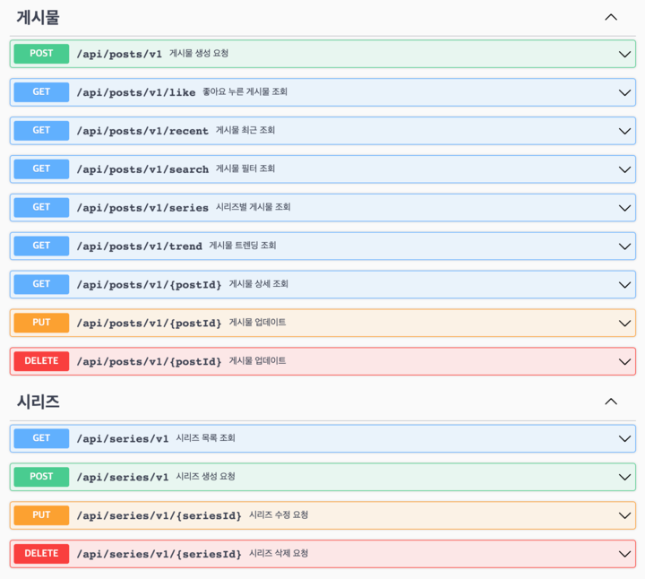
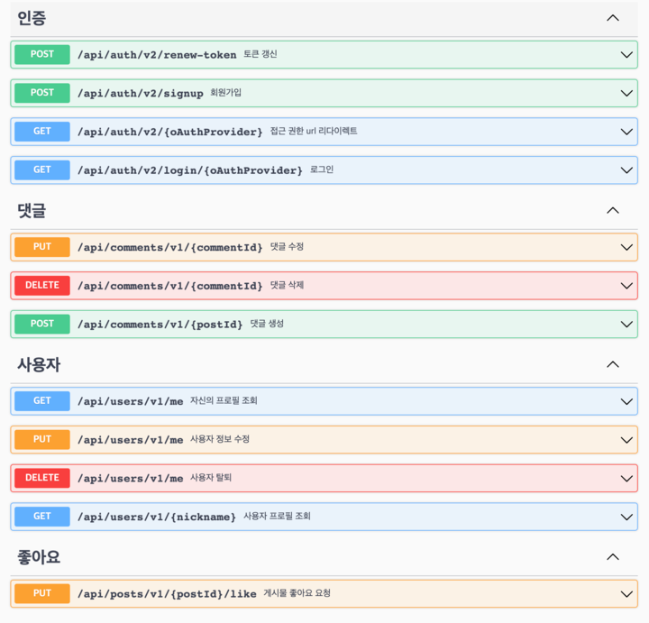

<h1 align="center"> 🍀 Velog 클론 코딩 </h1>  

  

----

## 👨‍👩‍👧‍👦 멤버
|                                            SM                                             |                                             PO                                              |                                         Developer                                          |                                           Mento                                            |                                           Mento                                            |    
|:-----------------------------------------------------------------------------------------:|:-------------------------------------------------------------------------------------------:|:------------------------------------------------------------------------------------------:|:------------------------------------------------------------------------------------------:|:------------------------------------------------------------------------------------------:|
|  |  |  |  |  |  
|                           [유명한](https://github.com/yumyeonghan)                           |                              [고범준](https://github.com/K-jun98)                              |                              [박은지](https://github.com/1o18z)                               |                           [함승훈](https://github.com/seung-hun-h)                            |                             [유도진](https://github.com/dojinyou)                             |
  
     

## ⭐️ 선정 이유
1. 기본적인 CRUD를 구현하기 좋고, 여러 기능을 추가해 볼 수 있는 모델이라고 판단되었다.   
   
2. 협업 경험 위주로 하기 위해 팀원이 익숙한 도메인을 선정하고자 했고, 해당 조건에 만족했다.

     

## 👨🏻‍💻 사용자 요청 흐름도

  

## ⛓ CI/CD

  

   

## ⚙️ 기술 스택

### 🏷 서버

### 🏷 인프라

  

   

## 📊 테스트 커버리지

  

      

## 📋 API 문서화

   

